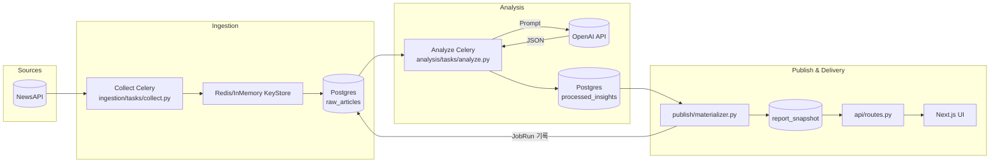
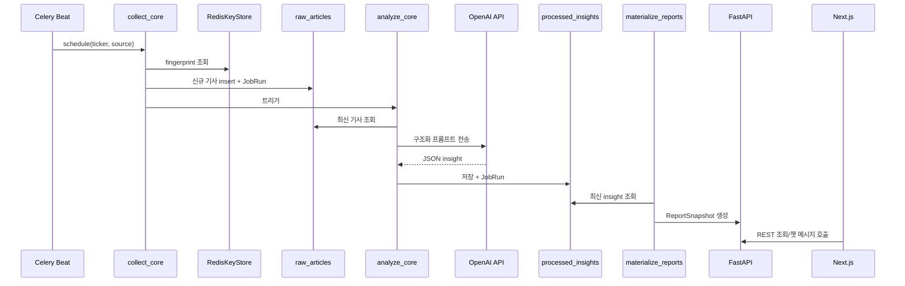

# StockTeacher 시스템 아키텍처

## 시스템 개요

### 미션 및 목표
StockTeacher는 투자자가 구독한 종목에 대한 뉴스·공시·SNS 동향을 수집·분석하여 요약 리포트를 제공합니다. 사용자는 웹 포털에서 리포트를 열람하며 에이전트와 대화로 후속 질의를 처리할 수 있습니다. 수집과 분석은 OpenAI LLM을 활용하며, 결과는 웹 인터페이스를 통해 안정적으로 노출됩니다.

### 핵심 사용 시나리오
1. 사용자가 웹 포털에 로그인해 관심 종목을 등록·관리하고 알림 빈도를 설정합니다.
2. 스케줄러가 주기적으로 종목 관련 데이터를 외부 API로부터 수집하고 전처리합니다.
3. Python 분석 파이프라인이 수집된 데이터를 정규화하고 LLM을 호출해 요약·키워드·감성·이상징후를 생성합니다.
4. 리포트 엔진이 분석 결과를 DB와 스토리지에 저장하고, 웹 포털은 리포트 목록/상세/대화 인터페이스로 사용자에게 제공합니다.

### 성공 지표(KPI)
- 일일 리포트 생성 성공률 98% 이상
- 데이터 수집 완료부터 웹 포털에 리포트 게시까지 10분 이내
- 리포트 열람 후 에이전트 대화 개시 비율 30% 이상
- 자동 분류/요약 오류율 2% 이하

---

## 기능 목록

### MUST (필수 기능)
- 종목 구독/해지 및 현재 구독 현황 조회 (웹 포털 UI + 백엔드 API)
- 뉴스·공시 API 연동 (NewsAPI)
- 텍스트 정규화: 언어 감지, 중복 제거, URL·해시태그 정규화
- LLM 기반 분석: 토픽/키워드 추출, 요약, 감성/이상 이벤트 탐지
- 웹 리포트 화면: 일일 요약, 메트릭, 원문 링크, 관련 아티팩트 뷰어
- 웹 기반 에이전트 채팅: 리포트 컨텍스트 기반 후속 질의 응답
- 시스템 상태 모니터링 및 실패 시 Dead-letter 처리

### SHOULD (권장 기능)
- 종목별 알림 시간대·빈도 커스터마이즈
- 요약 품질 검증 자동화(간단 룰/프롬프트) 및 리뷰 대기함
- 다국어(영/한) 분석 모델 선택 지원
- 리포트 상세에서 관련 차트/지표 시각화

### NICE (향후 기능)
- 개인화된 사용자 관심사 분석 및 이상징후 알림
- 이메일/모바일 푸시 등 추가 알림 채널
- 주간/월간 추세 리포트 대시보드
- 급등락 감지 시 실시간 웹 알림(Toast/모달)
- Slack 봇 연동 (현재 웹 우선, 향후 확장)

---

## 전체 아키텍처 다이어그램

### 파이프라인 흐름



### 데이터 파이프라인 시퀀스



---

## 화면 및 데이터 흐름

### 주요 페이지/컴포넌트
- **구독 관리 페이지** (`/subscriptions`): 종목 검색, 등록/해지, 알림 설정
- **리포트 목록 페이지** (`/reports`): 날짜 필터, 감성 태그, 즐겨찾기
- **리포트 상세 페이지** (`/reports/:id`): 요약 블록, 감성 ASCII 게이지, 핵심 링크, 아티팩트 뷰어
- **대화형 에이전트 패널**: 리포트 컨텍스트를 유지한 채팅 UI
- **관리자 콘솔** (SHOULD): 파이프라인 상태, 실패 로그, 수동 재처리 트리거

### 주요 상태 전환
- **종목 구독**: Pending Verification → Active → Suspended
- **데이터 수집 파이프라인**: Scheduled → Fetching → Normalized → Ready → Failed(Retry)
- **분석 파이프라인**: Queued → Processing → Completed → Failed(Retry)
- **리포트 전달 파이프라인**: Materializing → Published → Read → Archived → Failed(Manual Action)
- **에이전트 세션**: Initiated → Conversing → Handover (필요 시) → Completed
- **임계치 초과 시**: SLA Breach → Ops 채널 알림 → Manual Intervention

---

## 데이터 스키마

### 핵심 테이블

#### StockSubscription
사용자의 종목 구독 정보
- `subscription_id` (PK)
- `user_id` (FK)
- `ticker` (종목 코드)
- `alert_window` (알림 빈도)
- `status` (Active/Suspended)
- `created_at`, `updated_at`

#### RawArticle
수집된 원본 기사 데이터
- `article_id` (PK)
- `source_type` (press/api/sns)
- `ticker`
- `title`, `body`, `url`
- `collected_at`
- `language`
- `sentiment_raw`

**보존 정책**: 7일 (PostgreSQL)

#### ProcessedInsight
LLM 분석 결과
- `insight_id` (PK)
- `ticker`
- `summary_text` (요약)
- `sentiment_score` (감성 점수 -1.0 ~ 1.0)
- `keywords[]` (핵심 키워드)
- `anomaly_score` (이상 징후 점수)
- `source_refs[]` (출처 참조)
- `generated_at`
- `llm_model`, `llm_tokens_prompt`, `llm_tokens_completion`, `llm_cost`

**보존 정책**: 90일 (PostgreSQL)

#### JobRun
파이프라인 작업 실행 추적
- `job_id` (PK)
- `stage` (collect/analyze/publish/chat)
- `status` (SUCCESS/FAILED/RUNNING)
- `started_at`, `ended_at`
- `retry_count`
- `error_code`
- `trace_id` (분산 추적)

#### ChatSession
채팅 세션 정보
- `session_id` (PK)
- `user_id` (FK)
- `insight_id` (FK → ProcessedInsight)
- `status` (Initiated/Conversing/Completed)
- `started_at`, `ended_at`
- `handoff_required` (에스컬레이션 필요 여부)

#### ChatMessage
채팅 메시지
- `message_id` (PK)
- `session_id` (FK)
- `sender` (user/agent/system)
- `content` (메시지 내용)
- `created_at`
- `metadata` (JSON, 추가 컨텍스트)

### 저장소 및 보존 정책

#### PostgreSQL (RDS/Aurora)
주요 메타데이터 저장소
- `raw_articles`: 7일 보존
- `processed_insights`: 90일 보존
- `job_runs`, `chat_sessions`, `chat_messages`: 무기한 (주기적 아카이빙)

#### Local Filesystem Storage
원문 스냅샷과 모델 출력 캐시 (`./var/storage` 또는 `LOCAL_STORAGE_ROOT`)
- 디렉터리 구조: `{ticker}/YYYY/MM/DD/{article_id}.*`
- 장기 보존은 S3 이전 전까지 로컬에 유지, 향후 S3 백엔드로 교체 예정

#### Redis/ElastiCache
- 중복 검출 (24h TTL)
- 파이프라인 상태 캐시
- 채팅 세션 컨텍스트 임시 저장 (1시간 TTL)

#### 외부 API
- DART 공시 (향후)
- News API (현재 주요 소스)
- SNS 공식 API (향후)
- OpenAI API (GPT-4o-mini)

#### 보안
- 모든 토큰은 KMS/Secrets Manager 암호화
- 로그에서 PII 제거
- 최소 권한 IAM 정책 적용

---

## 계층별 아키텍처

### 데이터 수집 계층 (Ingestion)

**위치**: `ingestion/`

**책임**:
- Celery Beat + Worker 기반 스케줄링
- 소스 커넥터 모듈화 (API 우선, 보조 크롤링/캐시)
- Rate Limit 감시와 백오프 전략
- 실패 이벤트 추적

**핵심 컴포넌트**:
- `ingestion/celery_app.py:17`: Celery 팩토리 + Beat 스케줄 구성
- `ingestion/tasks/collect.py:60`: collect_core - 수집 핵심 로직
- `ingestion/connectors/news_api.py`: NewsAPI 커넥터
- `ingestion/services/deduplicator.py:31`: RedisKeyStore - 중복 제거
- `ingestion/services/normalizer.py`: 텍스트 정규화, 언어 감지
- `ingestion/repositories/articles.py`: RawArticle/JobRun 저장

**설정**:
- `INGESTION_REDIS_URL`: Celery 브로커 및 중복 제거 캐시
- `COLLECTION_SCHEDULES`: JSON 배열로 종목/소스/간격 정의
- `NEWS_API_KEY`, `NEWS_API_TIMEOUT_SECONDS`, `NEWS_API_PAGE_SIZE`

**데이터 흐름**:
1. Celery Beat이 스케줄에 따라 collect_articles_for_ticker 태스크 생성
2. 커넥터가 외부 API 호출
3. Normalizer가 텍스트 정규화 및 fingerprint 생성
4. Deduplicator가 Redis + DB로 이중 중복 검사
5. 신규 데이터를 RawArticle 테이블에 저장
6. JobRun 레코드로 성공/실패 추적

**참고 문서**: [ingestion/README.md](./ingestion/README.md)

---

### 분석 계층 (Analysis)

**위치**: `analysis/`

**책임**:
- OpenAI LLM 호출 및 구조화 응답 파싱
- 프롬프트 매개변수화 (종목·기간·언어·금칙어)
- 비용 가드레일 및 재시도 로직
- 토큰/비용 메트릭 기록

**핵심 컴포넌트**:
- `analysis/tasks/analyze.py:45`: analyze_core - 분석 핵심 로직
- `analysis/client/openai_client.py:78`: OpenAI 클라이언트 래퍼
  - TransientLLMError 발생 시 지터 백오프와 최대 3회 재시도
  - 비용 상한 초과 시 PermanentLLMError 발생
- `analysis/prompts/templates.py`: 프롬프트 템플릿 빌더
- `analysis/repositories/insights.py`: ProcessedInsight 저장

**기본 모델**: GPT-4o-mini (품질 요구 시 상위 모델 옵션 제공)

**설정**:
- `OPENAI_API_KEY`: OpenAI API 키 (필수)
- `ANALYSIS_MODEL`: 모델 이름 (기본 gpt-4o-mini)
- `ANALYSIS_MAX_TOKENS`: 완성 토큰 상한 (기본 512)
- `ANALYSIS_TEMPERATURE`: 샘플링 온도 (기본 0.2)
- `ANALYSIS_COST_LIMIT_USD`: 요청당 비용 상한 (기본 $0.02)
- `ANALYSIS_REQUEST_TIMEOUT_SECONDS`: HTTP 타임아웃 (기본 15초)
- `ANALYSIS_RETRY_MAX_ATTEMPTS`: 재시도 횟수 (기본 2회)
- `DEFAULT_LOCALE`: 프롬프트 로케일 (기본 ko_KR)

**데이터 흐름**:
1. analyze_core가 최신 raw_articles 조회 (최근 5건)
2. 프롬프트 템플릿으로 구조화 메시지 생성
3. OpenAI API 호출 (JSON 모드)
4. 응답 파싱 및 검증
5. ProcessedInsight 테이블에 저장 (summary_text, keywords, sentiment_score, anomalies)
6. JobRun(stage=analyze) 기록 (토큰/비용 포함)

**출력 구조 (JSON)**:
```json
{
  "summary_text": "요약 (최대 1200자)",
  "keywords": ["키워드1", "키워드2", ...],
  "sentiment_score": 0.5,
  "anomalies": [
    {"label": "이벤트명", "description": "설명", "score": 0.8}
  ]
}
```

**참고 문서**: [analysis/README.md](./analysis/README.md)

---

### 게시 계층 (Publish)

**위치**: `publish/`

**책임**:
- ProcessedInsight를 웹 사용을 위한 ReportSnapshot으로 변환
- 아티팩트 관리 (이미지/PDF 링크)
- SLA 모니터링 (10분 이내 게시)
- 중복 게시 방지 (Idempotency)

**핵심 컴포넌트**:
- `publish/materializer.py:18`: materialize_reports - Materializer 핵심 로직

**데이터 흐름**:
1. materialize_reports가 미게시 ProcessedInsight 조회
2. ReportSnapshot 생성 (DB `report_snapshot` 테이블)
3. 정적 자산 `./var/storage`에 보관
4. JobRun(stage=publish) 기록
5. SLA 초과/실패는 Ops 알림으로 승격

**참고 문서**: [publish/README.md](./publish/README.md)

---

### 웹 애플리케이션 계층 (Web + API)

**위치**: `web/` (프론트엔드), `api/` (백엔드)

**책임**:
- 사용자 인증 및 권한 관리 (OAuth2/SSO)
- 구독 관리 CRUD
- 리포트 조회 및 필터링
- 채팅 인터페이스 (WebSocket 또는 Server-Sent Events)

#### 프론트엔드 (Next.js)

**기술 스택**: Next.js 14, React 18, TypeScript

**주요 화면**:
- `web/app/subscriptions/page.tsx:21`: 구독 관리
- `web/app/reports/page.tsx`: 리포트 목록
- `web/app/reports/favorites/page.tsx`: 즐겨찾기 리포트
- `web/app/reports/[insightId]/page.tsx:27`: 리포트 상세 + 채팅 UI
- `web/components/ReportsBoard.tsx:27`: 리포트 보드 컴포넌트

**현재 구현**:
- 폴링 방식 채팅 (3초 간격)
- 향후 WebSocket으로 업그레이드 예정

#### 백엔드 (FastAPI)

**기술 스택**: FastAPI, SQLAlchemy, PostgreSQL

**주요 엔드포인트**:
- `GET /api/subscriptions`: 구독 목록
- `POST /api/subscriptions`: 구독 생성
- `GET /api/reports`: 리포트 목록 (필터링/페이징)
- `GET /api/reports/:id`: 리포트 상세
- `POST /api/chat/sessions`: 채팅 세션 생성
- `POST /api/chat/sessions/:id/messages`: 메시지 전송
- `GET /api/chat/sessions/:id/messages`: 메시지 조회

**핵심 컴포넌트**:
- `api/main.py:9`: FastAPI 앱 + CORS 설정
- `api/routes.py:92`: 라우트 핸들러
- `api/repositories.py:162`: 데이터 액세스 레이어
- `api/db_models.py:81`: ORM 모델 (ChatSession, ChatMessage)

#### 채팅 콘텍스트 관리
- 최근 N개 메시지를 Redis에 저장 (1시간 TTL)
- 장기 대화는 ChatMessage 테이블에 기록
- 인사이트/문서 링크는 grounding 정보로 제공
- 민감 데이터 마스킹

**참고 문서**:
- [web/README.md](./web/README.md)
- [api/README.md](./api/README.md)

---

## 기술 스택

### 백엔드
- **언어**: Python 3.13+
- **프레임워크**: FastAPI 0.115, Celery 5.5
- **데이터베이스**: PostgreSQL 16 (프로덕션), SQLite (로컬 개발)
- **ORM**: SQLAlchemy 2.0
- **마이그레이션**: Alembic 1.13
- **캐시/브로커**: Redis 7
- **LLM**: OpenAI API (GPT-4o-mini)

### 프론트엔드
- **프레임워크**: Next.js 14.2 (App Router)
- **언어**: TypeScript 5.4
- **UI 라이브러리**: React 18.3

### 인프라
- **컨테이너**: Docker, Docker Compose
- **로깅**: structlog (JSON/텍스트 전환 지원)
- **추적**: trace_id 기반 분산 추적
- **저장소**: Local Filesystem (향후 S3)

### 개발 도구
- **패키지 관리자**: uv (권장), pip (대안)
- **테스트**: pytest 8.4, Playwright 1.48 (E2E)
- **코드 품질**: CLAUDE.md 규칙 준수

---

## 비기능 요구사항

### 성능
- 수집 작업: 기본 1일 1회 + 온디맨드 실행 옵션
- Rate Limit 준수 및 백오프 적용
- 데이터 수집 → 웹 게시: 10분 이내 (SLA)
- 리포트 조회 응답 시간: <500ms

### 보안
- 인증: OAuth2/SSO (웹 기반)
- 권한: RBAC (일반 사용자/관리자)
- 최소 권한 IAM
- 네트워크 아웃바운드 제한
- OpenAI 비용/토큰 감시
- 비밀값 암호화 (KMS/Secrets Manager)
- 로그에서 PII 제거

### 접근성
- WCAG 준수
- 다크 모드 (SHOULD)
- 다국어 UI (NICE)

### 규제 준수
- 데이터 보존 기간 준수 (RawArticle 7일, ProcessedInsight 90일)
- 사용자 데이터 삭제 요청 처리 (GDPR/국내 규제)

### 로깅 및 관찰성
- **구조화 로깅**: JSON 포맷 + trace_id 전파
- **환경 변수**:
  - `STRUCTLOG_LEVEL`: 로그 레벨 (INFO/DEBUG)
  - `LOG_JSON`: JSON 로그 활성화 (1=true, 0=false)
- **메트릭**:
  - 파이프라인 단계별 처리 시간
  - LLM 토큰/비용
  - 웹 응답 시간
  - 채팅 전환율
- **알림**:
  - 실패 파이프라인
  - LLM 비용 초과
  - SLA 위반
  - PagerDuty/Slack Ops 채널 연동

### 에러 처리
- Dead-letter Queue (향후 SQS 등) 영구 실패 보존
- 관리 콘솔에서 재처리
- JobRun 테이블로 실패 추적 및 분석

---

## 핵심 모듈 참조

| 모듈 | 핵심 파일 | 설명 |
|-----|---------|------|
| Ingestion | `ingestion/tasks/collect.py:60` | collect_core - 수집 로직 |
|  | `ingestion/celery_app.py:23` | Celery 스케줄러 구성 |
|  | `ingestion/services/deduplicator.py:31` | Redis 기반 중복 제거 |
|  | `ingestion/settings.py:78` | 설정 및 검증 |
| Analysis | `analysis/tasks/analyze.py:45` | analyze_core - 분석 로직 |
|  | `analysis/client/openai_client.py:78` | OpenAI 클라이언트 (재시도, 비용 추적) |
|  | `analysis/prompts/templates.py` | 프롬프트 템플릿 |
| Publish | `publish/materializer.py:18` | ReportSnapshot 생성 |
| API | `api/routes.py:92` | FastAPI 라우트 |
|  | `api/repositories.py:162` | 데이터 액세스 (채팅) |
|  | `api/db_models.py:81` | ORM 모델 (ChatSession, ChatMessage) |
| Web | `web/app/subscriptions/page.tsx:21` | 구독 관리 |
|  | `web/components/ReportsBoard.tsx:27` | 리포트 보드 |
|  | `web/app/reports/[insightId]/page.tsx:27` | 상세 + 채팅 UI |
| Logging | `ingestion/utils/logging.py:40` | 구조화 로깅 |

---

## 관련 문서

- **모듈별 상세 문서**: [README.md](./README.md) 참조
- **운영 가이드**: [OPERATIONS.md](./OPERATIONS.md)
- **테스트 전략**: [TESTING.md](./TESTING.md)
- **의사결정 로그**: [DECISIONS.md](./DECISIONS.md)
- **로드맵**: [ROADMAP.md](./ROADMAP.md)
- **발표 자료**: [reference/presentation.md](./reference/presentation.md)
