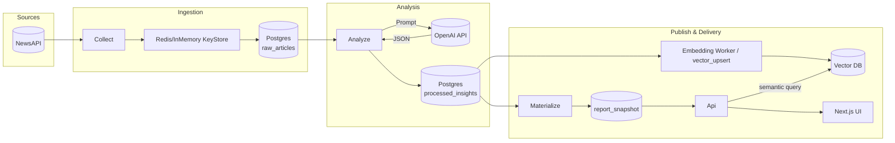
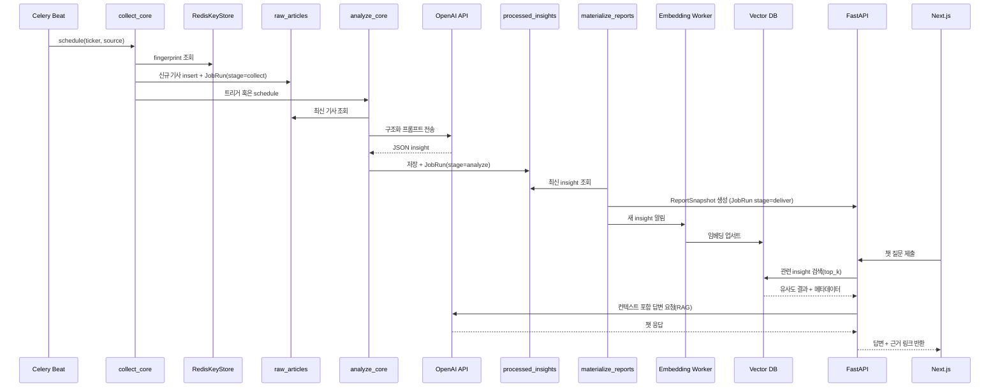

# StockTeacher 설명

## 1. 프로젝트 개요

| 항목        | 내용                                                                                                                     |
| ----------- | ------------------------------------------------------------------------------------------------------------------------ |
| 미션        | 주식/공시/SNS 뉴스를 분 단위로 수집·요약해 Slack 리포트와 웹 포털로 전달                                                 |
| 형태        | Python 기반 3단계 파이프라인(Ingestion → Analysis → Publish) + FastAPI API + Next.js 대시보드 + Vector DB 기반 검색/챗봇 |
| 주요 데이터 | raw_articles(수집 원문), processed_insights(LLM 요약), report_snapshot(웹/챗 노출), insight_embeddings(Vector DB)        |
| 운영 환경   | Python 3.13+, Celery, Redis, PostgreSQL, Vector DB(chroma 등), OpenAI API, Next.js 14                                    |
| 현재 범위   | NewsAPI 기반 뉴스 수집, LLM 요약, 웹 포털/챗 MVP + Vector DB 도입으로 추천·RAG 챗 지원                                   |

## 2. 아키텍처

## 3. 데이터 파이프라인 & 챗봇 RAG 흐름

